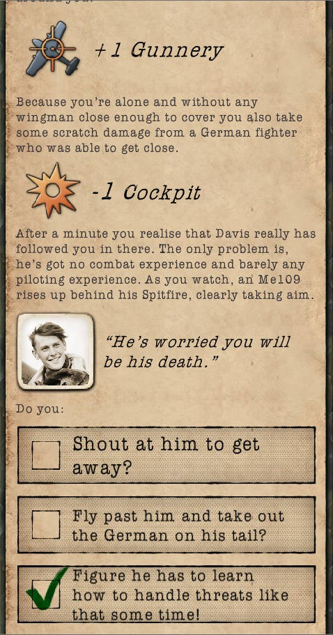

https://github.com/adam-p/markdown-here/wiki/Markdown-Cheatsheet

Este proyecto contiene un draft en el que se está desarrollando el plot, reglas y mecánicas de una ficción interactiva o text adventure que tiene lugar en la Patagonia Argentina sobre la base histórica y documentada del paso de Butch Cassidy por la región en los años 1901-1905. Instpirado tanto en investigaciones bien documentadas, publicaciones, como en mitos, leyendas, viajes y entrevistas, que recuperan ese aire farwest que sobrevive aun hoy en el folklore del sur argentino. 

La aventura está enfocada principalmente en el período en el que "Butch Cassidy" pasa casi un año sólo (sin sus compañeros "familia de 3") en la región de Cholila. Etapa interpretada como el inicio de la reincidencia, donde Butch se hace visible al mundo a través de una famosa carta en clave con destino a su wild branch.   

El borrador está escrito en castellano con un marcado (pseudo markdown) e indicaciones y funciones que pueden facilmente transcribirse a ink. Lenguaje en el que se prepararán las compilaciones (usando inklecate) del pre-alfa.

-----------------------------------
Notas de desarrollo

En el proceso de desarrollo se van dando en el borrador los contenidos, reglas, nociones generales y particulares sobre el juego etc. 
Al final del borrador se van agregando los hilos y opciones que se van abriendo, pendientes, para ser retomadas en el desarrollo. Creo que esta es una buena forma de no perder el globo de la historia. 
En los diferentes commit del borrador se puede ir viendo el proceso de expansión.

------------------------------------
Voy a agregar variables que tienen que ver con modalidades del relato y que posiblemente se setéen desde un inicio con elgún tipo de menú. 

** VAR historificacion = false **
imprime información historica si la variable es verdadera al comienzo de escenas, secuencias, sitios y personajes

** VAR notas/desarrollo = false **  
imprime notas de viajes, datos complementarios de actualidad, referencias, diario de viaje, notas de desarrollo, etc

** VAR gamificacion = false **
imprime información sobre niveles, puntos alcanzados, objetivos, del estilo de completar niveles, iniciar niveles, y secuencias de logros, recuentos (puntos) etc. 

---------------
RPG - RoleplayGames y Romanticismo. 
Los juegos de mesa, tablas, dados, cartas, piezas y papel hen sido por lo general hasta el RPG juegos clásicos. 
Clasichen, Clasic, son una forma moderna universal y hasta mátemática de comprender las mecánicas de juego. El RPG introduce al PJ al igual que el romanticismo introduce a un sujeto aunque más no sea para perderlo en la naturaleza. El rol tiene un poco de eso y la aventura comienza. Pra escribir sobre el RPG y el romanticismo, porqué el plot romántico se elije para el gamewriting.
------------------
## UI nota:
Estaria bueno para opciones de historiestá diferente para entrar en modo conversacion. Imagen del personaje con el que estás conversando.  Y distinta ui para los diálogos.  Esta está buena para usar de base. 

